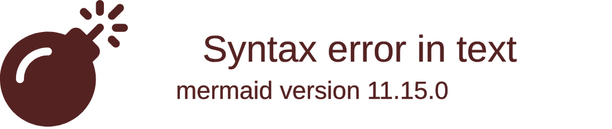

## Overview

We are working on a set of tasks to implement links for the gitGraph diagram module.
**GitHub Issue:** https://github.com/mermaid-js/mermaid/issues/5599
**Goal:** Add `click` statement support to gitGraph for commits - mirroring existing flowchart link functionality.

## **Implementation Plan:** See [PROJECT.md](./PROJECT.md)

## Before You Start

CONTRIBUTING.md should be considered the general truth to building and testing.
It has a lot of content so be prudent in how you read it so you don't overwhelm the context window.

**IMPORTANT:** Always run the bootstrap command first to ensure dependencies are installed and the environment is ready.

### Commands

| Command                         | Purpose                  |
| ------------------------------- | ------------------------ |
| `pnpm install`                  | Install dependencies     |
| `pnpm build`                    | Build all packages       |
| `pnpm test`                     | Run unit tests           |
| `pnpm test -- --grep "pattern"` | Run specific tests       |
| `pnpm e2e`                      | Run Cypress visual tests |
| `pnpm dev`                      | Start dev server         |

---

## Repository Structure

### GitGraph Source Files

```packages/mermaid/src/diagrams/git/
├── gitGraphAst.ts          # Database/state - WHERE TO ADD setLink, getLink
├── gitGraphRenderer.ts     # SVG rendering - WHERE TO BIND click events
├── gitGraphTypes.ts        # TypeScript types
├── parser/gitGraph.jison   # Parser grammar - WHERE TO ADD click syntax
└── styles.ts               # CSS styles - WHERE TO ADD hover styles
```

### Reference Implementation

These should be considered a solid reference for implementing links since they are already used for another graph type.

```packages/mermaid/src/diagrams/flowchart/
├── flowDb.ts               # REFERENCE: setLink, setTooltip functions
├── flowRenderer-v3-unified.ts  # REFERENCE: click binding
└── parser/flow.jison       # REFERENCE: click grammar rules
```

### Test Files

```packages/mermaid/src/diagrams/git/__tests__/
└── gitGraph.spec.ts        # Unit tests
cypress/integration/rendering/
└── gitGraph.spec.js        # Visual regression tests
```

### Documentation

```docs/syntax/
├── gitgraph.md             # WHERE TO ADD click documentation
└── flowchart.md            # REFERENCE: Interaction section format
```

---

## Implementation Approach

### TDD Workflow

For each task:

1. **Write failing test** - Add test that exercises the new functionality
2. **Run test, confirm failure** - Verify the test fails as expected
3. **Implement** - Write the minimum code to pass
4. **Run test, confirm pass** - Verify implementation works
5. **Commit** - One focused commit per task

### Code Style

- **Match existing patterns** - Look at similar code in the same file
- **Follow flowchart's approach** - The click/link implementation should mirror flowchart
- **Use existing utilities** - `sanitizeUrl`, `sanitizeText` from utils

### Commit Messages

Follow conventional commits:

```feat(gitGraph): <description>
<body explaining what and why>
```

**IMPORTANT:** Do not link to the GitHub issue in the commit message or pull request description.
This causes excessive noise on the original issue.

---

## Target Syntax

The final syntax mirrors flowchart exactly:



Variations:

- `click <id> "<url>"`
- `click <id> "<url>" "<tooltip>"`
- `click <id> "<url>" _blank`
- `click <id> "<url>" "<tooltip>" _blank`

---

## Reference: Flowchart Link Implementation

### [flowDb.ts](packages/mermaid/src/diagrams/flowchart/flowDb.ts) - Link Storage

```typescript
export const setLink = (ids: string[], linkStr: string, target: string) => {
  ids.forEach((id) => {
    if (vertices.get(id) !== undefined) {
      vertices.get(id)!.link = sanitizeUrl(linkStr);
      vertices.get(id)!.linkTarget = target;
    }
  });
  setClass(ids, 'clickable');
};
```

### [flow.jison](packages/mermaid/src/diagrams/flowchart/parser/flow.jison) - Parser Grammar

```jison
"click"                                   return 'CLICK';
\_blank                                   return 'LINK_TARGET';
\_self                                    return 'LINK_TARGET';
clickStatement
    : CLICK WORD STR                      {yy.setLink([$2], $3);}
    | CLICK WORD STR LINK_TARGET          {yy.setLink([$2], $3, $4);}
    | CLICK WORD STR STR                  {yy.setLink([$2], $3);yy.setTooltip([$2], $4);}
    | CLICK WORD STR STR LINK_TARGET      {yy.setLink([$2], $3, $5);yy.setTooltip([$2], $4);}
    ;
```

### Renderer - Click Binding

```typescript
if (vertex.link) {
  element.classed('clickable', true);
  element.style('cursor', 'pointer');
  element.on('click', () => {
    window.open(vertex.link, vertex.linkTarget || '_self');
  });
}
```

---

## Notes for Jules

- Each task file is self-contained with all context needed
- Always run tests before and after implementation
- Match the code style you see in surrounding code
- When in doubt, look at how flowchart does it
- Commit after each completed task
- **DO NOT** link to the GitHub issue in commit messages or PR descriptions to avoid noise.
